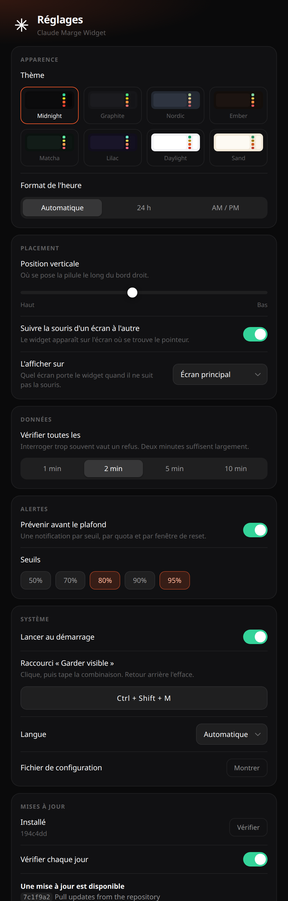

<div align="center">

# Claude Marge Widget

**Tes limites d'usage Claude, Pro et Max, au bord de l'écran.**
La souris touche le bord droit, il glisse. Elle s'en va, il disparaît.


[](#compatibilité)
[](#compatibilité)
[](#compatibilité)
[](LICENSE)

[English](README.md)

</div>

---

## Installation, une seule commande

```bash
curl -fsSL https://raw.githubusercontent.com/Ulrichfr/Claude-Marge-Widget/main/install.sh | bash
```

C'est tout. Le script vérifie Node, clone dans `~/.claude-marge`, installe les
dépendances, lance les tests, enregistre le démarrage automatique, démarre le
widget, et te dit s'il a trouvé ta session Claude.

Ensuite, amène la souris **au bord droit de l'écran, à mi-hauteur**.

Tu préfères lire le script avant de le passer à un shell ? C'est légitime :

```bash
git clone https://github.com/Ulrichfr/Claude-Marge-Widget.git ~/.claude-marge
cd ~/.claude-marge && npm install && npm test
bash install.sh
```

La désinstallation tient elle aussi en une commande, et elle ne touche jamais à
tes identifiants Claude :

```bash
bash ~/.claude-marge/uninstall.sh
```

---

## Un anneau par quota, parce que ce ne sont pas les mêmes

Un abonnement Claude n'a pas une limite mais plusieurs : une fenêtre glissante de cinq
heures, un budget hebdomadaire tous modèles confondus, et un budget hebdomadaire
distinct pour chaque modèle lourd. Celle qui t'arrête est rarement celle que tu
surveillais.


La liste est construite à partir de ce que ton compte expose vraiment : deux
anneaux ou cinq selon ton offre. Une limite que l'API ne renvoie pas est
absente, plutôt que dessinée en zéro trompeur, et le badge **limite active**
signale celle qui coupera en premier.

Les couleurs suivent la marge restante, pas le modèle : vert sous 35 %, jaune
jusqu'à 69 %, orange jusqu'à 89 %, rouge au-delà.


---

## Sept langues, choisies toutes seules

Anglais par défaut, et ta langue système si c'est le français, l'espagnol,
l'allemand, l'italien, le chinois ou le japonais. Rien à régler.


Ajouter une langue, c'est ajouter un objet dans [`src/i18n.js`](src/i18n.js).
Les contributions sont bienvenues.

---

## Comment ça marche

**D'où viennent les chiffres.** Du point d'entrée que Claude Code appelle
lui-même :

```
GET https://api.anthropic.com/api/oauth/usage
```

Ce sont tes vraies limites, pas une estimation reconstruite à partir d'un
comptage de jetons.

**D'où vient le jeton.** De là où Claude Code le range : le Trousseau sur macOS,
`~/.claude/.credentials.json` ailleurs. Il n'est jamais copié, jamais mis en
cache sur disque, jamais envoyé ailleurs qu'à `api.anthropic.com`.

Le widget ne renouvelle jamais le jeton lui-même : faire tourner le jeton de
rafraîchissement invaliderait ta session Claude Code. Quand il a expiré, le
widget le dit, et il suffit d'ouvrir Claude Code une fois.

**Comment le survol fonctionne.** La fenêtre est *toujours* transparente aux
clics. Elle ne prend jamais le focus et n'avale jamais un clic, même visible. Le
survol est déduit de la position du curseur, échantillonnée 22 fois par seconde
côté processus principal, puis transmise à la page qui fait son propre
hit-test. C'est la seule méthode qui se comporte pareil sur macOS et sur X11.

**Comment il se fait oublier.** Fenêtre transparente, sans cadre, sans ombre,
absente de la barre des tâches et du Dock. Elle se redimensionne selon le nombre
de quotas exposés par ton compte, et resserre sa disposition sur un écran court
plutôt que de déborder en bas.

---

## Compatibilité

| Système | État | Détail |
|---|---|---|
| **macOS 12+** (Intel et Apple Silicon) | Pris en charge, testé | Testé sur macOS 26.5 arm64. Installe un LaunchAgent. |
| **Linux, X11** | Pris en charge, testé | Installe un service systemd utilisateur. |
| **Linux, Wayland** | Partiel | Electron ne sait pas positionner ses fenêtres sous Wayland. Le service force X11 ; en lancement manuel, ajouter `ELECTRON_OZONE_PLATFORM_HINT=x11`. |
| **Windows** | Non pris en charge | La couche de données fonctionnerait, le placement et le démarrage automatique ne sont ni écrits ni testés. Contributions bienvenues. |

**Offres.** Claude **Pro** et **Claude Max** exposent ces limites par le même
point d'entrée, et le widget affiche ce que le compte renvoie : deux anneaux sur
une offre qui expose moins de quotas, cinq sur une autre. Développé et testé sur
Max ; Pro devrait se comporter à l'identique, et un retour dans un sens comme
dans l'autre est bienvenu.

Prérequis : **Node.js 18+**, `git`, et Claude Code connecté.

Deux détails Linux qui valent d'être sus. Sans compositeur, la transparence
tombe et la pilule s'affiche en noir opaque au lieu de se fondre dans le bureau.
Et l'icône de barre d'état réclame `libappindicator` ; sans elle le widget
fonctionne, il n'y a simplement pas de menu.

---

## Configuration

`~/.config/claude-marge/config.json`, rechargeable depuis le menu de la barre
d'état :

```json
{
  "verticalAnchor": 0.45,
  "refreshSeconds": 120,
  "followCursorDisplay": true,
  "alertAt": [80, 95],
  "shortcut": "CommandOrControl+Shift+M",
  "theme": "midnight",
  "timeFormat": "auto",
  "displayId": "primary"
}
```

`alertAt` déclenche une notification quand un quota franchit l'un de ces seuils :
une fois par seuil, par quota et par fenêtre de reset, pour qu'une limite que tu
dépasses déjà ne te prévienne pas toutes les deux minutes. Mets `[]` pour le
silence complet. `shortcut` bascule l'épinglage ; mets `""` pour n'enregistrer
aucun raccourci. `language` vaut `auto`, ou l'un de `en`, `fr`, `es`, `de`,
`it`, `zh`, `ja`. `checkUpdates` active ou coupe la vérification quotidienne du
dépôt. `theme` vaut `midnight`, `graphite`, `nordic`, `ember`, `matcha`,
`lilac`, `daylight` ou `sand`. `timeFormat` vaut `auto`, `12` ou `24`.
`displayId` vaut `primary` ou un identifiant d'écran, et reste ignoré tant que
le widget suit la souris.

### Huit thèmes, clairs et sombres


Six sombres, deux clairs. Les couleurs de jauge restent sémantiques dans tous :
vert veut dire qu'il reste de la marge, rouge que le plafond est proche, et les
thèmes clairs reçoivent des teintes plus foncées et plus denses, parce qu'un
jaune pâle sur blanc ne dit rien du tout. La fenêtre de réglages porte elle
aussi le thème, donc le choix se prévisualise tout seul.

L'heure suit ton système par défaut, ou se fige en **24 h** ou **AM / PM**.

### Plusieurs écrans

Active **Suivre la souris d'un écran à l'autre** et le widget apparaît sur
l'écran où se trouve le pointeur. Désactive-le et il reste où tu l'as mis, sur
l'écran principal ou sur celui que tu choisis.

Seuls les vrais bords extérieurs déclenchent. La jointure entre deux écrans côte
à côte, jamais, parce que l'atteindre ferait surgir la pilule au milieu de ton
bureau. Les écrans qui vont et viennent sont gérés : branche une station
d'accueil, ferme un capot, change une résolution, et le widget se repositionne.
Un widget fixé sur un écran qu'on vient de débrancher retombe sur l'écran
principal, au lieu d'être dessiné hors du bureau où tu ne le reverrais jamais.

### Les réglages



Tout est dans le menu de la barre d'état, sous **Réglages**. La fenêtre fait 520
points de large et défile ; la capture de droite montre le panneau entier.

**Apparence.** Le thème, et si l'heure s'écrit en 24 h ou en AM / PM.

**Placement.** Où se pose la pilule le long du bord droit, si elle suit la
souris d'un écran à l'autre, et sur quel écran elle vit quand ce n'est pas le
cas.

**Données.** À quelle fréquence interroger. Deux minutes par défaut, parce que
demander plus souvent est exactement ce qui vaut un refus, et que ces chiffres
ne bougent pas plus vite que ça.

**Alertes.** Quels seuils doivent te prévenir avant le plafond. Chacun parle une
fois par quota et par fenêtre de reset, pour qu'une limite que tu dépasses déjà
ne te notifie pas toutes les deux minutes.

**Système.** Le lancement au démarrage, la langue, et le raccourci « Garder
visible ». Le champ de raccourci enregistre une vraie combinaison : tu cliques,
tu tapes, retour arrière efface. Une lettre seule est refusée, elle se
déclencherait pendant que tu écris ailleurs.

**Mises à jour.** Voir ci-dessous.

Les changements s'appliquent dès l'enregistrement : le widget se repositionne,
la langue bascule, le raccourci se réenregistre, le prochain appel est
replanifié. Rien ne redémarre. La fenêtre écrit le même `config.json` que tu
peux toujours modifier à la main, et **Montrer** l'ouvre.

<br clear="all">

### Garder visible


L'épinglage garde la **pilule** sortie, pas la bulle. La bulle est la moitié
large, et la laisser en travers de l'écran toute la journée prendrait beaucoup
de place ; elle continue d'aller et venir avec le pointeur, exactement comme au
survol normal.

`Cmd/Ctrl+Maj+M` bascule le mode, et le raccourci se change dans les Réglages.

<br clear="all">

### Les mises à jour

Le widget se met à jour depuis ce dépôt. **Vérifier** compare ta copie au
dernier commit de `main` ; **Mettre à jour et relancer** le récupère, installe
les éventuelles nouvelles dépendances et redémarre. Avec **Vérifier chaque
jour**, il regarde une fois par jour et te dit quand quelque chose attend, une
seule fois par version, sans jamais rien installer de lui-même.

Le point qui compte : **une mise à jour qui casse les tests est annulée.** Le
commit d'origine est noté d'abord, les 71 tests tournent avant la relance, et un
échec ramène la copie exactement où elle était. Une mauvaise publication en
amont ne peut pas te laisser un widget mort.

Deux refus, tous deux volontaires. Une copie avec des modifications non
commitées n'est jamais écrasée, parce que quelqu'un travaille manifestement
dedans. Et une copie dont la révision est illisible est signalée comme inconnue
plutôt que proposée à la mise à jour : écraser ce qu'on ne sait pas identifier
est pire que se taire.

À la main, c'est la même chose :

```bash
cd ~/.claude-marge && git pull && npm install && npm test
```

### Le menu de la barre d'état

| Entrée | Ce qu'elle fait |
|---|---|
| Rafraîchir maintenant | Interroge l'API tout de suite, quel que soit le rythme prévu. |
| Afficher 3 secondes | Montre le widget sans aller chercher le bord. |
| **Lancer au démarrage** | Case à cocher. La décocher laisse tourner le widget en cours, il ne reviendra simplement pas à ta prochaine session. |
| **Garder visible** | Épingle la pilule ouverte, sans survol. Aussi sur un raccourci global, `Cmd/Ctrl+Maj+M` par défaut. |
| **Relancer le widget** | Redémarre par le superviseur, pratique après un changement de configuration. |
| Réglages… | Ouvre la fenêtre de réglages. |
| Rechercher des mises à jour… | Interroge le dépôt et ouvre les Réglages sur le résultat. |
| Montrer le fichier de configuration | Ouvre `config.json` dans ton éditeur. |
| Quitter | Quitte vraiment. Le démarrage automatique relance après un plantage, jamais après un « Quitter » volontaire. |

Tu l'as fermé et tu le veux de retour ?
`launchctl kickstart gui/$(id -u)/com.claudemarge.widget` sur macOS,
`systemctl --user start claude-marge` sur Linux.

### Le fichier

`verticalAnchor` vaut 0 en haut de l'écran et 1 en bas. `followCursorDisplay`
fait apparaître le widget sur l'écran où se trouve la souris. En multi-écrans,
seuls les vrais bords extérieurs déclenchent : la jointure entre deux écrans
côte à côte, jamais.

Commandes utiles :

```bash
npm start                         # comportement au survol
npm run demo                      # reste ouvert, pratique pour régler la position
npm run usage                     # les quotas bruts en JSON, sans interface
npm test                          # 71 tests
tail ~/.claude-marge/widget.log   # une ligne par changement d'état
```

---

## Ce qui est vérifié

`npm test` lance 71 tests, sur les endroits où une erreur se voit tout de suite.

**La géométrie du survol et les écrans, 22 tests.** Le bord droit en
multi-écrans, la jointure entre deux écrans qui ne déclenche jamais, un écran
choisi puis débranché qui retombe sur le principal, la fenêtre qui reste dans
l'écran quel que soit le nombre de modèles, et surtout l'absence de
clignotement : la zone qui garde le widget ouvert doit toujours contenir la
bande qui le déclenche.

**Les thèmes et le format d'heure, 8 tests.** Chaque thème définit toutes ses
surfaces et toutes ses teintes, un thème inconnu retombe sur un autre plutôt que
de ne rien peindre, les quatre teintes restent distinctes pour que les jauges ne
mentent pas, les thèmes clairs utilisent une encre foncée et l'inverse, et
`auto` laisse vraiment la locale décider au lieu de forcer un cycle.

**La normalisation des quotas, 8 tests.** Un quota absent ne devient jamais un
zéro affiché, un modèle exposé deux fois par l'API n'apparaît qu'une fois, une
réponse vide ne fait pas tomber le widget, et une panne est nommée pour ce
qu'elle est au lieu d'être mise sur le dos du réseau.

**Les alertes, 8 tests.** Franchir un seuil parle une fois, rester au-dessus se
tait, le seuil supérieur reparle, une nouvelle fenêtre de reset réarme, et le
registre oublie les quotas que le compte n'expose plus.

**Les sept langues, 3 tests.** Elles doivent exposer exactement les mêmes clés :
une clé manquante ne plante pas, elle écrit silencieusement `undefined` dans
l'interface de quelqu'un.

**L'état persisté, 7 tests.** Le compteur d'échecs et la dernière vraie lecture
survivent à un redémarrage, une lecture de plus d'un jour est écartée plutôt
qu'affichée comme actuelle, et un fichier d'état corrompu ne fait pas tomber le
widget.

**La mise à jour, 7 tests.** Une réponse malformée de GitHub ne produit rien
plutôt qu'un demi-objet, une révision locale illisible n'est jamais prise pour
une mise à jour, et un dossier sans git est signalé comme incapable de se mettre
à jour.

**Le ralentissement, 8 tests.** Interroger trop souvent, c'est exactement ce qui
vaut un HTTP 429 : le widget interroge toutes les deux minutes, double l'attente
après chaque échec jusqu'à quinze minutes, obéit à `Retry-After` quand le
serveur en envoie un, et ne relance pas un appel juste parce que tu as survolé.
Un appel raté n'efface jamais l'affichage : les derniers vrais chiffres restent,
marqués comme datés, avec la raison en dessous.

Pour vérifier le rendu sur une machine sans compositeur, ou en intégration
continue :

```bash
MARGE_CAPTURE=/tmp/widget.png npm run demo
```

---

## Vie privée

Le widget fait exactement un appel réseau, vers `api.anthropic.com`, avec ton
propre jeton, pour lire ta propre consommation. Aucune télémétrie, aucune
analyse d'usage, aucun tiers. Le journal enregistre des pourcentages et des
changements d'état, jamais le jeton.

---

## Licence et mentions

[MIT](LICENSE). Projet personnel non officiel, sans affiliation avec Anthropic
ni soutien de sa part. « Claude » est une marque d'Anthropic.
