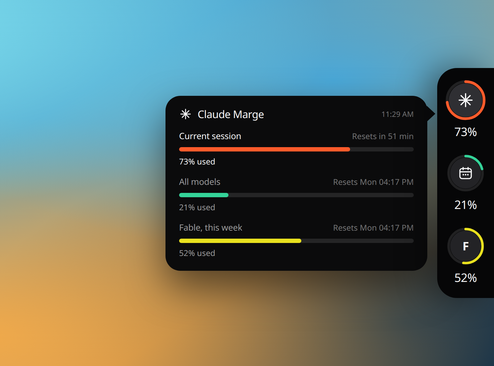
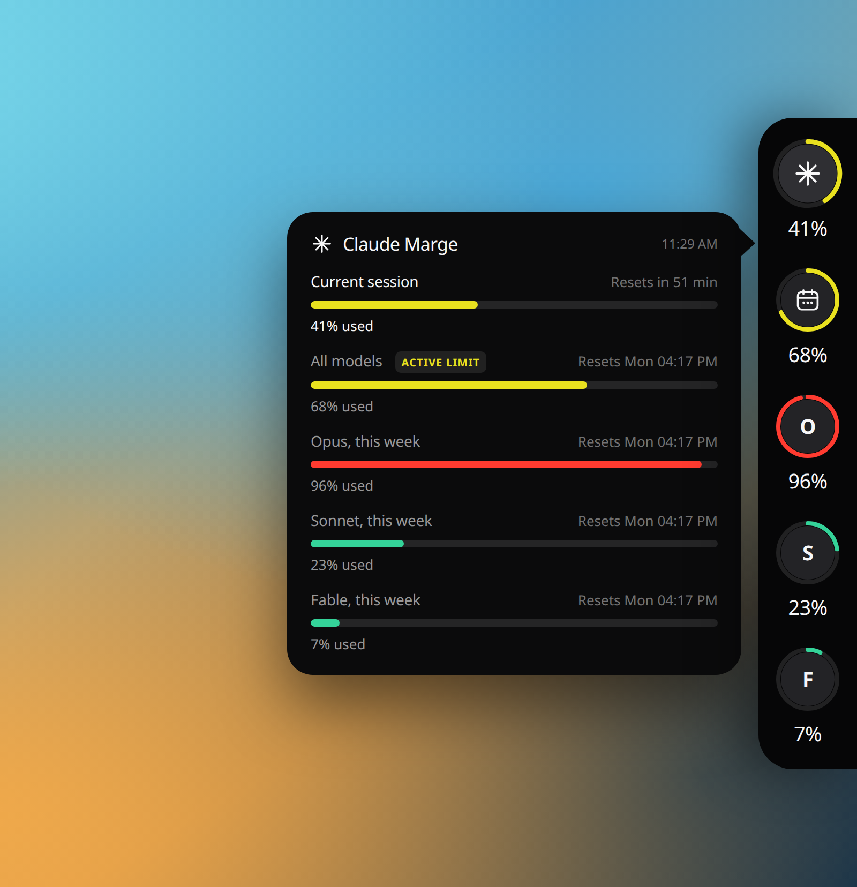
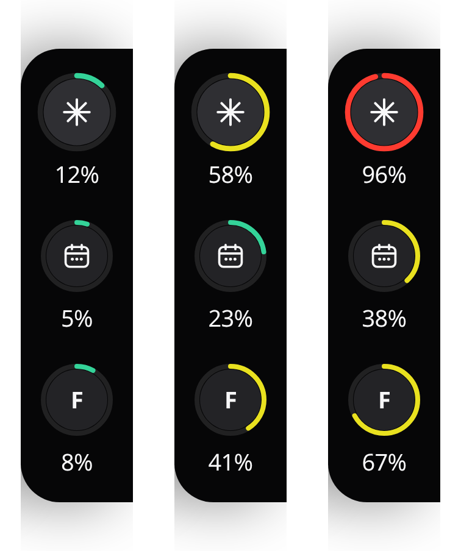
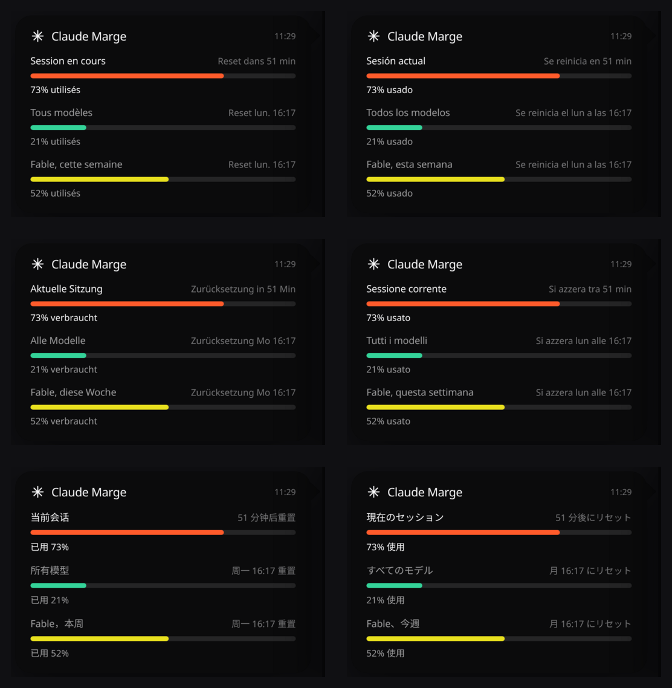
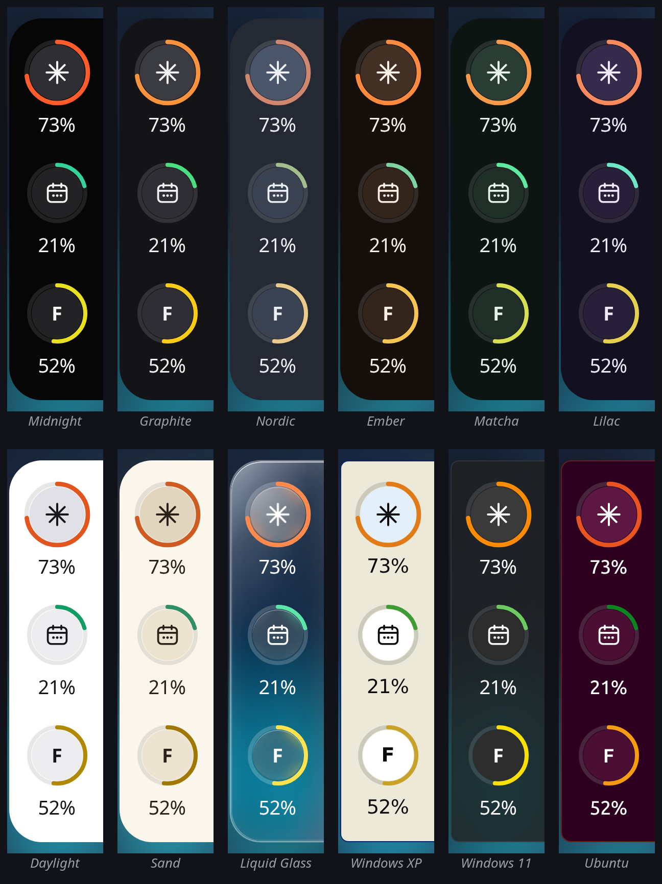
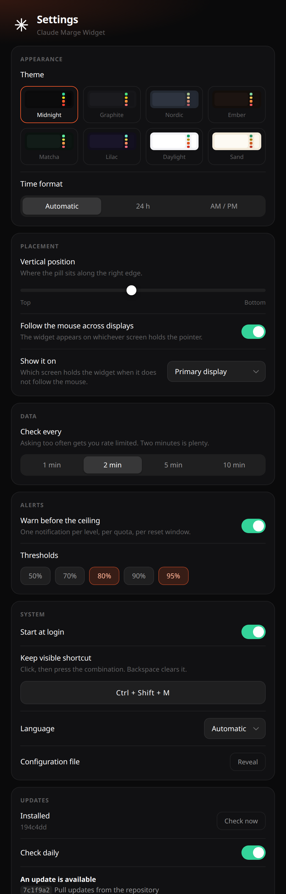
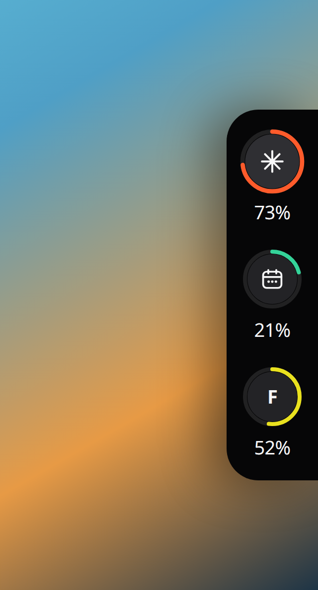

<div align="center">

# Claude Marge Widget

**Your Claude usage limits, Pro and Max, at the edge of the screen.**
Touch the right edge with your mouse and it slides in. Move away and it is gone.



[](#compatibility)
[](#compatibility)
[](#compatibility)
[](LICENSE)

[Français](README.fr.md)

</div>

---

## Install in one command

```bash
curl -fsSL https://raw.githubusercontent.com/Ulrichfr/Claude-Marge-Widget/main/install.sh | bash
```

That is the whole setup. The script checks Node, clones into `~/.claude-marge`,
installs dependencies, runs the test suite, registers a login item, starts the
widget, and tells you whether it found your Claude session.

Then move your mouse to the **right edge of the screen, halfway down**.

Prefer to read the script before piping it into a shell? Fair enough:

```bash
git clone https://github.com/Ulrichfr/Claude-Marge-Widget.git ~/.claude-marge
cd ~/.claude-marge && npm install && npm test
bash install.sh
```

If Electron does not unpack, the installer notices and repairs it rather than
declaring success on an app that cannot start. npm 11 blocks package install
scripts by default, which leaves Electron downloaded but never extracted, and a
partly extracted bundle on macOS is missing its framework. Both look identical
from the outside: nothing launches.

Removing it is one command too, and it never touches your Claude credentials:

```bash
bash ~/.claude-marge/uninstall.sh
```

---

## One ring per quota, because they are not the same quota

A Claude subscription does not have a single limit. There is a rolling five hour session
window, a weekly budget across every model, and a separate weekly budget for
each heavy model. The one that stops you is rarely the one you were watching.



The list is built from what your account actually exposes, so you get two rings
or five depending on your plan. A limit the API does not return is left out
rather than drawn as a misleading zero, and the **active limit** badge marks the
one that will cut you off first.

Colours follow the headroom, not the model: green below 35%, yellow to 69%,
orange to 89%, red beyond.



---

## Seven languages, picked automatically

English by default, and your system language when it is one of French, Spanish,
German, Italian, Chinese or Japanese. Nothing to configure.



Adding a language means adding one object to [`src/i18n.js`](src/i18n.js).
Pull requests welcome.

---

## How it works

**Where the numbers come from.** The same endpoint Claude Code itself calls:

```
GET https://api.anthropic.com/api/oauth/usage
```

These are your real limits, not an estimate reconstructed from token counts.

**Where the token comes from.** Wherever Claude Code keeps it: the Keychain on
macOS, `~/.claude/.credentials.json` elsewhere. It is never copied, never cached
on disk, and never sent anywhere other than `api.anthropic.com`.

The widget never refreshes the token itself. Rotating the refresh token would
invalidate your Claude Code session, so when it has expired the widget says so
and you simply open Claude Code once.

**How the hover works.** The window is *always* click-through. It never takes
focus and never swallows a click, even while visible. Hover is derived from
sampling the cursor position 22 times a second in the main process, then handed
to the page, which does its own hit-testing. It is the only approach that
behaves identically on macOS and X11.

**How it stays out of the way.** The window is transparent, frameless, has no
shadow, no taskbar entry, and no Dock icon. It resizes itself to the number of
quotas your account exposes, and tightens its layout on short screens instead of
running off the bottom.

---

## Compatibility

| System | State | Notes |
|---|---|---|
| **macOS 12+** (Intel and Apple Silicon) | Supported, tested | Tested on macOS 26.5 arm64. Installs a LaunchAgent. |
| **Linux, X11** | Supported, tested | Installs a systemd user service. |
| **Linux, Wayland** | Partial | Electron cannot position windows under Wayland. The service forces X11; launch manually with `ELECTRON_OZONE_PLATFORM_HINT=x11`. |
| **Windows** | Not supported | The data layer would work, the placement and autostart are not written or tested. Contributions welcome. |

**Plans.** Claude **Pro** and **Claude Max** both expose these limits through the
same endpoint, and the widget reads whatever the account returns: two rings on a
plan with fewer quotas, five on one with more. Developed and tested on Max; Pro
should work identically, and a report either way is welcome.

Requirements: **Node.js 18+**, `git`, and Claude Code signed in.

Two Linux details worth knowing. Without a compositor, transparency falls back
to an opaque black pill instead of blending into the desktop. And the tray icon
needs `libappindicator`; without it the widget still runs, there is simply no
menu.

---

## Configuration

`~/.config/claude-marge/config.json`, reloaded from the tray menu:

```json
{
  "verticalAnchor": 0.45,
  "refreshSeconds": 300,
  "followCursorDisplay": true,
  "alertAt": [80, 95],
  "shortcut": "CommandOrControl+Shift+M",
  "theme": "midnight",
  "timeFormat": "auto",
  "displayId": "primary"
}
```

`alertAt` raises a desktop notification when a quota crosses one of those marks:
once per level, per quota, per reset window, so a limit you are sitting above
does not notify you every two minutes. Set it to `[]` to stay silent.
`shortcut` toggles the pinned view; set it to `""` to register nothing.
`language` is `auto`, or one of `en`, `fr`, `es`, `de`, `it`, `zh`, `ja`.
`checkUpdates` turns the daily look at the repository on and off. `theme` is one
of `midnight`, `graphite`, `nordic`, `ember`, `matcha`, `lilac`, `daylight`,
`sand`, `glass`, `win95`, `winxp`, `aqua`, `win11`, `ubuntu`. `timeFormat` is
`auto`, `12` or `24`. `displayId` is `primary` or a
screen id, and is ignored while the widget follows the mouse.

### Fourteen themes



Six neutral darks, two lights, and six with a point of view: **Liquid Glass**,
**Windows 95**, **Windows XP**, **Mac OS X Aqua**, **Windows 11** in Mica, and
**Ubuntu** in Yaru aubergine.

The three period themes are not recolours. Colours alone cannot express an era,
so a theme may bring its own chrome: Windows 95 gets the double bevel, square
corners and segmented progress blocks; Windows XP gets the Luna blue frame, its
glossy title bar and gel that fills in segments; Mac OS X Aqua gets pinstripes,
a lit top edge and the candy-striped progress bars that looked wet. Each one
brings its typeface with it. The gauge tones stay semantic in every one of them: green
means room left, red means the ceiling is close, and the light themes get
darker, denser tones because a pale yellow on white says nothing at all. The
settings window wears the theme too, so the choice previews itself.

**About Liquid Glass.** The window really is transparent, so the wallpaper shows
through for real, with a specular rim and a trace of dispersion at the edges.
What it does not do is blur the desktop behind it: a transparent Electron window
can only blur what the page itself contains, and blurring the desktop would mean
macOS vibrancy, which paints the whole window rectangle rather than the shape of
a rounded pill. Apple's material leans on clarity and refraction more than on
frost, so this reads as glass; it is simply clear rather than frosted.

Times follow your system by default, or you can pin **24 h** or **AM / PM**.

### Multiple displays

Turn **Follow the mouse across displays** on and the widget appears on whichever
screen holds the pointer. Turn it off and it stays where you put it, on the
primary display or on a screen you pick.

Only real outer edges trigger it. The seam between two side-by-side screens
never does, because reaching it would make the pill surface in the middle of
your desktop. Screens that come and go are handled: plug a dock in, close a lid,
change a resolution, and the widget repositions itself. A widget pinned to a
screen that has just been unplugged falls back to the primary rather than being
drawn off the desktop, where you would never see it again.

### Settings



Everything is in the tray menu, under **Settings**. The window is 520 points
wide and scrolls; the shot on the right shows the whole sheet.

**Appearance.** The theme, and whether times read as 24 h or AM / PM.

**Placement.** Where the pill sits along the right edge, whether it follows the
mouse from one display to another, and which screen it lives on when it does
not.

**Data.** How often to ask. Five minutes is the default: these numbers move
slowly, and every machine signed into your account asks separately, so two
laptops at two minutes is already 1440 calls a day. The widget also stops asking
when the machine sleeps or the screen locks, asks four times less often after
five idle minutes, and if the account ever refuses, it slows down for good and
only speeds back up after five clean reads.

**Alerts.** Which marks should warn you before the ceiling. Each one speaks once
per quota per reset window, so a limit you are already sitting above does not
notify you every two minutes.

**System.** Start at login, the language, and the keep-visible shortcut. The
shortcut field records a real combination: click it, press the keys, Backspace
clears it. A bare letter is refused, since it would fire while you type
anywhere else.

**Updates.** See below.

**Every change applies the moment you make it, and is remembered.** There is no
Save button, because a settings window that has to be confirmed lies about what
you are looking at: pick a theme and the widget repaints under it, move the
slider and the pill moves. The language switches, the shortcut rebinds, the next
call is rescheduled, and nothing restarts. It all lands in the same
`config.json` you can still edit by hand, and **Reveal** opens it.

<br clear="all">

### Keep visible



Pinning keeps the **pill** out, not the panel. The panel is the wide half, and
leaving it across the screen all day would be a lot to give up; it still comes
and goes with the pointer, exactly as it does on a normal hover.

`Cmd/Ctrl+Shift+M` toggles it, and the shortcut is yours to change in Settings.

<br clear="all">

### Updating

The widget updates itself from this repository. **Check now** compares your
checkout against the latest commit on `main`; **Update and restart** fetches it,
installs any new dependencies, and relaunches. With **Check daily** on, it looks
once a day and tells you when something is waiting, once per version, and never
installs anything on its own.

The part worth knowing: **an update that breaks the test suite is undone.**
The commit you were on is recorded first, the 75 tests run before the restart,
and a failure rolls the checkout back to where it was. A bad push upstream
cannot leave you with a dead widget.

Two refusals, both deliberate. A copy with uncommitted local changes is never
overwritten, because someone is clearly working in it. And a checkout whose
revision cannot be read is reported as unknown rather than offered an update,
since overwriting something we cannot identify is worse than saying nothing.

Updating by hand does the same thing:

```bash
cd ~/.claude-marge && git pull && npm install && npm test
```

### The tray menu

| Item | What it does |
|---|---|
| Refresh now | Ask the API immediately, whatever the schedule says. |
| Show for 3 seconds | Reveal the widget without reaching for the edge. |
| **Start at login** | Checkbox. Turning it off leaves the running widget alone, it simply will not come back at your next login. |
| **Keep visible** | Pin the pill open, no hovering. Also on a global shortcut, `Cmd/Ctrl+Shift+M` by default. |
| **Restart the widget** | Relaunch through the supervisor, handy after a config change. |
| Settings… | Open the settings window. |
| Check for updates… | Look at the repository and open Settings on the result. |
| Reveal the config file | Open `config.json` in your editor. |
| Quit | Really quits. The login item restarts the widget after a crash, never after a deliberate quit. |

**Closed it and want it back?** Quitting takes the tray icon with it, so the
installer leaves two ways in. On macOS, a **Claude Marge** launcher in
`~/Applications`, which Spotlight finds by name; on Linux, an entry in the
application menu. And on both, a command:

```bash
marge            # start it, or restart it if it is already running
marge stop       # quit it until the next login
marge status     # is it running, and what did it last read
marge logs       # follow the log
marge update     # pull, install, test, restart
```

### The file

`verticalAnchor` is 0 at the top of the screen and 1 at the bottom.
`followCursorDisplay` makes the widget appear on whichever display holds the
mouse. On a multi-monitor setup, only real outer edges trigger it: the seam
between two side-by-side screens never does.

Useful commands:

```bash
npm start                      # hover behaviour
npm run demo                   # stays open, handy for positioning
npm run usage                  # raw quotas as JSON, no interface
npm test                       # 75 tests
tail ~/.claude-marge/widget.log   # one line per state change
```

---

## What is verified

`npm test` runs 75 tests, covering the places where a mistake shows up
immediately.

**Hover geometry and displays, 22 tests.** The right edge of a multi-monitor
setup, the seam between two screens never triggering, a chosen display that has
been unplugged falling back to the primary, the window staying on screen
whatever the number of models, and above all the absence of flicker: the area
that keeps the widget open must always contain the strip that triggers it.

**Themes and time format, 12 tests.** Every theme defines every surface and tone,
an unknown one falls back rather than painting nothing, the four tones stay
distinct so the gauges cannot lie, light themes use dark ink and dark themes
light ink, a translucent theme has to declare its material rather than being a
flat wash, a period theme really carries its chrome instead of being a
recolour, that chrome contains style and nothing else, a corner radius of zero
survives rather than being replaced by the default, and `auto` genuinely lets
the locale decide instead of forcing a cycle.

**Quota normalisation, 8 tests.** A missing quota never becomes a displayed
zero, a model exposed twice by the API appears once, an empty response does not
bring the widget down, and a failure is named for what it is rather than blamed
on the network.

**Alerts, 8 tests.** Crossing a threshold speaks once, staying above it stays
quiet, the next level up speaks again, a new reset window arms it afresh, and
the ledger forgets quotas the account stopped exposing.

**The seven languages, 3 tests.** They must expose exactly the same keys: a
missing one does not crash, it quietly prints `undefined` in someone's
interface.

**Persisted state, 7 tests.** The failure count and the last real reading
survive a restart, a reading older than a day is dropped rather than shown as
current, and a corrupted state file does not bring the widget down.

**Updating, 7 tests.** A malformed answer from GitHub produces nothing rather
than half an object, an unreadable local revision is never treated as an update,
and a directory without git is reported as unable to update itself.

**Backoff, 8 tests.** Asking too often is what earns an HTTP 429, so the widget
polls every two minutes, doubles the wait after each failure up to fifteen
minutes, obeys `Retry-After` when the server sends one, and does not fetch again
just because you hovered. A failed call never wipes the display: the last real
numbers stay on screen, marked stale, with the reason underneath.

For a render check on a machine with no compositor, or in CI:

```bash
MARGE_CAPTURE=/tmp/widget.png npm run demo
```

---

## Privacy

The widget makes exactly one network call, to `api.anthropic.com`, with your own
token, to read your own usage. No telemetry, no analytics, no third party. The
log records percentages and state changes, never the token.

---

## License and attribution

[MIT](LICENSE). An unofficial personal project, not affiliated with, endorsed
by, or supported by Anthropic. "Claude" is a trademark of Anthropic.
